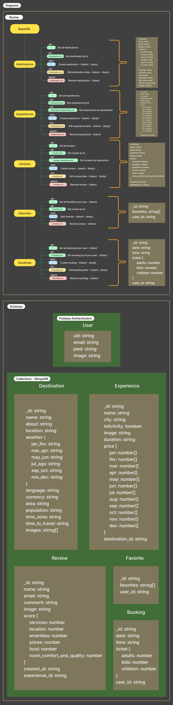

# Compass Challenge - Trisog Restful API

<div align="center">
  
    
    
  
  
  
  
  
  
  
  
  
  
  
  
  
  
  
  
  
  
  
</div>

<div align="center">
  <br/>
  
</div>

> The software developed is a web application created for the Compass Challenge, whose focus is the creation of a travel agency website.

## Tópicos

:small_blue_diamond: [🔗 Access URLs](#-access-urls)

:small_blue_diamond: [📫 Documentation](#-documentation)

:small_blue_diamond: [🗻 Challenge](#-challenge)

:small_blue_diamond: [🛠 Built with](#-built-with)

:small_blue_diamond: [🏡 Execution locally](#-execution-locally)

:small_blue_diamond: [🐳 Execution docker](#-execution-docker)

:small_blue_diamond: [🙌 Recognition](#-recognition)

:small_blue_diamond: [📄 License](#-license)

## 🔗 Access URLs

To access the API Trisog in production or homologation environments:

<div align="center">

| Ambiente       | URL                               |
| -------------- | ----------------------------------|
| `Production`   | https://trisog-api.vercel.app     |
| `Homologation` | https://trisog-api-hom.vercel.app |

</div>

For detailed information about the project, visit [Project Documentation](#-documentation).

## 📫 Documentation

The project documentation is available at the following links:

- [Figma Prototypes](https://www.figma.com/design/I96XeStHlz7igQI0KMcUIb/Desafio-3---Compass-UOL?node-id=6803-1073&t=c3kRxZZcv3xrOgQc-0): This link provides access to Figma prototypes, showcasing the design and layout of the web application.
- [Insomnia Collection](docs/insomnia-collection.json): This file contains the Insomnia collection with all the API requests. You can import this collection into Insomnia to easily test the endpoints.

### Importing Insomnia Collection

To facilitate API testing, we have provided an Insomnia collection. Follow these steps to import it:

- Download the file [insomnia-collection.json](docs/insomnia-collection.json).
- Open [Insomnia](https://insomnia.rest/download).
- Click on "File" -> "Import/Export" -> "Import Data".
- Select "From File" and choose the downloaded file.
- The collection will be imported, and you can view and test the requests.

### Using Swagger Documentation

The Swagger documentation provides a comprehensive overview of the API endpoints. You can use tools like [Swagger UI](https://swagger.io/tools/swagger-ui/) to visualize and interact with the API. Follow these steps to use the Swagger documentation:

- Download the file [swagger.yaml](src/swagger/swagger.yaml).
- Open [Swagger Editor](https://editor.swagger.io/).
- Import the `swagger.yaml` file to load the API documentation.
- Explore the available endpoints and their details.

Be sure to review these documents to gain more insights into the landing page project and understand the design and functionality requirements. For more detailed information about the web application requirements, please refer to the [challenge](#-challenge) section.

## 🗻 Challenge

### Challenge Description

You will need to recreate the three pages mentioned above while staying true to your original design.

Delivery date: 09/03/2024 – 5:30 pm – Tuesday.

Each presentation will last a maximum of 10 minutes.

### The **MANDATORY** requirements are:

- Use front-end in React with TypeScript.
- Back-end in Node (TypeScript required).
- Use of any is prohibited.
- Database using mongoDB or sql lite.
- It is necessary to protect the Tours route.
- Create sliders to display the most popular tours and types of activities in the sessions, in Carousel format. Library recommendation: [Splide](https://splidejs.com/), [Splide for React docs.](https://splidejs.com/integration/react-splide/) (Feel free to use the library of your choice).
- Use [Firebase](https://firebase.google.com/docs/auth?hl=pt-br), to handle user authentication. Authentication must be possible with: email, Facebook and Google.
- All features must be using the API developed in Node, data persistence should not be done in the Front. - You can use an external library for styling.
- You must choose the images.
- Create a private repository on your Github and add the instructors as collaborators to the project.
- Add a README to your project.
- Make small commits and use Conventional Commits to keep your repository organized.
- All images must be hosted in an S3 bucket (general purpose) or Firebase Storage.

#### Header:
- Login/Sign up page with the design created by you;
- Search button searching for all existing tours.
#### Footer:
- Each social network link must redirect to the home page of each network.
- Email field must be validated.
#### Home:
- Develop the search field.
- The Type field is an ‘Experience’ field, such as beaches.
- Tours Session must contain the most popular tours session chosen by you, and the data must come from the back-end, and must be in carousel format, the number of tours must be 8 (eight).
- Hover on the favorite button.
- Session to choose a ‘Type’ must come with the API data, the logic will be: search in the back-end how many tours there are with x category and render this value and the minimum value among those tours. For example: in the API there are 15 Tours with the Beaches category, and the minimum value is from $650, so it should render ‘15 Tours+’ and ‘From $650’. Render all categories that are in the back-end.
- Contact Us has no functionality.
- Top Attractions Cards must bring data from the back-end, displaying at least 6 cards. If you choose to make the pages optional, the click must redirect to the destination details page.
#### Destination - OPCIONAL:
- Top Attractions cards must bring data from the back-end, displaying at least 12 cards. We recommend doing this with Grid. When clicking on a card, it will direct you to the details page of that destination.
#### Destination Details - OPCIONAL:
- Fixed images, ‘See more photos’ button does not need to be functional.
- Use Google Maps API to bring the location of the destination.
- Use Weather API to bring information from the local weather table.
- Destination information all coming from the back-end.
- Carousel with popular tours in that destination, when clicking on ‘See All’ it should direct to the tours page with the filter for that place selected.
- ‘Activities’ carousel should be disregarded.
#### Tour Package:
- ALL FUNCTIONAL FILTERS.
- Filter data such as categories/destinations must come from the back-end.
- Must contain pagination directly from the back-end.
- Keep reviews with fixed value, they do not need to be broken values.
#### Tour Details:
- Fixed image of that destination.
- All tour information coming from the back-end.
- Sessions to be disregarded: Included/Exclude, Tour Places, Calendar & Price.
- Calculate as the user adds more people in the filter on the right-hand side menu.
- Use Google Maps API to bring the tour location.
#### Reviews:
- Average Reviews is an average of the reviews, so the highest rating should be an average of the other six ratings on the right.
- Values ​​can be integers.
- In the field to add a review, the user should rate each service by entering how many stars it deserves.
- The user should be able to enter the name and email of their choice. it is not necessary to retrieve it from the Login.
- The comment should be rendered on the page when submitted and the average reviews should change.

### The **OPTIONAL** requirements are:
- Responsive application.
- Landing page and destination details.

## 🛠 Built with

- [JavaScript](https://developer.mozilla.org/en-US/docs/Web/JavaScript): Widely used scripting programming language for web development.
- [Node.js](https://nodejs.org/en): JavaScript runtime platform based on Google's V8.
- [Express.js](https://expressjs.com/): Fast and minimalist web framework for Node.js.
- [TypeScript](https://www.typescriptlang.org/): JavaScript superset that adds static types and other features to the code.
- [MongoDB](https://www.mongodb.com/): Highly scalable and flexible NoSQL database.
- [Prisma](https://www.prisma.io/mongodb): ORM tool that facilitates interaction between Node.js and databases, offering an intuitive and secure interface for queries and data manipulation.
- [Firebase Authentication](https://firebase.google.com/products/auth): Comprehensive authentication service that provides secure user login via email, social media, or other authentication methods.
- [Firebase Storage](https://firebase.google.com/products/storage): Scalable and secure cloud storage solution for user-generated content, such as images and other media.
- [Yarn](https://yarnpkg.com/): Fast, reliable, and secure dependency manager.
- [Swagger UI](https://swagger.io/tools/swagger-ui/): Interactive user interface for exploring and testing RESTful APIs.
- [Docker](https://www.docker.com/): Platform that automates the deployment of applications within lightweight containers, ensuring consistency across different environments.
- [Docker Compose](https://docs.docker.com/compose/): Tool that simplifies multi-container Docker applications, allowing easy management and orchestration of services.
- [Jest](https://jestjs.io/): JavaScript testing framework that provides a complete and easy-to-use solution for unit testing, with features like snapshot testing and mocking.
- [Insomnia](https://insomnia.rest/): API client that allows developers to design, test, and debug APIs, providing a simple interface for sending HTTP requests and managing API endpoints.
- [Vercel](https://vercel.com/docs): Hosting platform that allows you to deploy web applications quickly and efficiently, with integrated CI/CD support.

These are the main technologies used to build this RESTful API. JavaScript and Node.js, with the Express.js framework, are responsible for creating the routes and handling the API's HTTP responses. TypeScript is used to add static typing, improving code maintainability and robustness. MongoDB is used as a database to store and retrieve application data efficiently. Prisma makes it easy to interact with MongoDB, offering an intuitive interface for queries and data manipulation. Firebase Authentication secures user access, while Firebase Storage handles user-generated content efficiently. Yarn is the dependency manager, ensuring reliable and fast package management. Swagger UI provides a user-friendly interface for exploring and testing the API. Docker and Docker Compose facilitate consistent deployment and management of the application across various environments. Jest ensures the codebase is thoroughly tested, enhancing reliability and performance. Insomnia is used to design, test, and debug API endpoints effectively. The application is deployed on Vercel, ensuring scalable and high-performance hosting. 

## 🏡 Execution locally

Make sure you have [Node.js](https://nodejs.org/en) installed on your machine before proceeding with these steps.

Follow the steps below to run the project locally on your machine:

* Clone this repository on your machine, entering the respective repository URL:
```
git clone https://github.com/ViniciusGR797/trisog-api.git
```

* Navigate to the cloned project directory:
```
cd trisog-api
```

* Create a file called **_.env_** and correctly configure the necessary environment variables. You can use the **_.env.sample_** file as a reference.


* Install the Yarn package manager:
```
npm install -g yarn
```

* Now, install all the dependencies listed in the 'package.json' file by running the following command:
```
yarn install
```

* With the dependencies installed, run the following command to start the server:
```
yarn start
```

* After running, you will be able to access the API through the local port provided in the terminal, for example: `http://localhost:3000/api-docs/`.

* If you want to stop the application from running, press `Ctrl + C` in the terminal, the project execution will be terminated.

## 🐳 Execution docker

Before running the project with Docker, make sure you have [Docker](https://www.docker.com/get-started) and [Docker Compose](https://docs.docker.com/compose/install/) installed on your machine.

To run the project using Docker, follow the steps below: * Create a file named **_.env_** and set up the appropriate environment variables. You can use the **_.env.sample_** file as a reference.

* In the terminal, navigate to the root folder of the project and run the following command: 
``` 
docker-compose up 
``` 
This will start the Docker containers required to run the project.

To stop the running of the containers, press `Ctrl + C` in the terminal. This will stop the running of the containers and free up the resources used.

If you want to run the project again using Docker, simply follow the previous steps again, ensuring that you have the **_.env_** file configured correctly and run the `docker-compose up` command in the terminal.

## 🙌 Recognition

I would like to take advantage of this space to express my sincere gratitude for the journey I took in carrying out this project:

<div align="center">
  <table>
    <tr>
      <td align="center">
        <a href="https://github.com/ViniciusGR797">
          <br>
          <sub>
            <b>Vinicius Gomes Ribeiro</b>
          </sub>
        </a>
      </td>
    </tr>
  </table>
</div>

Although it was an individual journey, this achievement would not have been possible without dedication, effort and commitment. Each stage of this project was driven by the commitment and skills I employed. I am deeply grateful for this opportunity to grow and learn.

## 📝 License

This project is licensed under the terms of [License](LICENSE). Please see the LICENSE file for more details.

The license chosen for the project is an important element to establish the rights to use, distribute and modify the source code. It is essential that all users, contributors and stakeholders review and understand the license terms and conditions before using or contributing to the project.

It is recommended that you carefully read the LICENSE file to ensure compliance with established rules and proper use of the code provided in this repository.

[⬆ Back to the top](#compass-challenge---trisog-restful-api)
